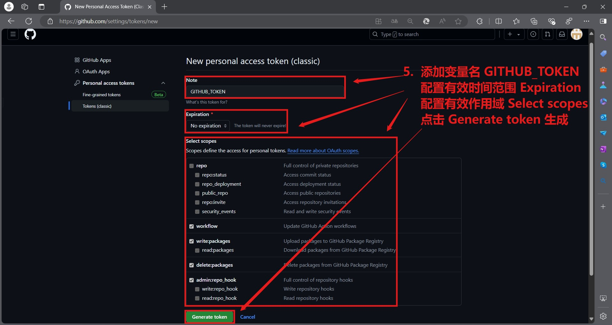
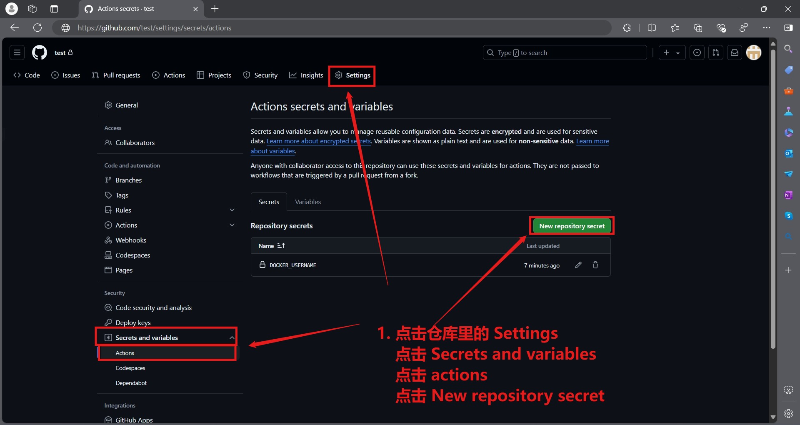
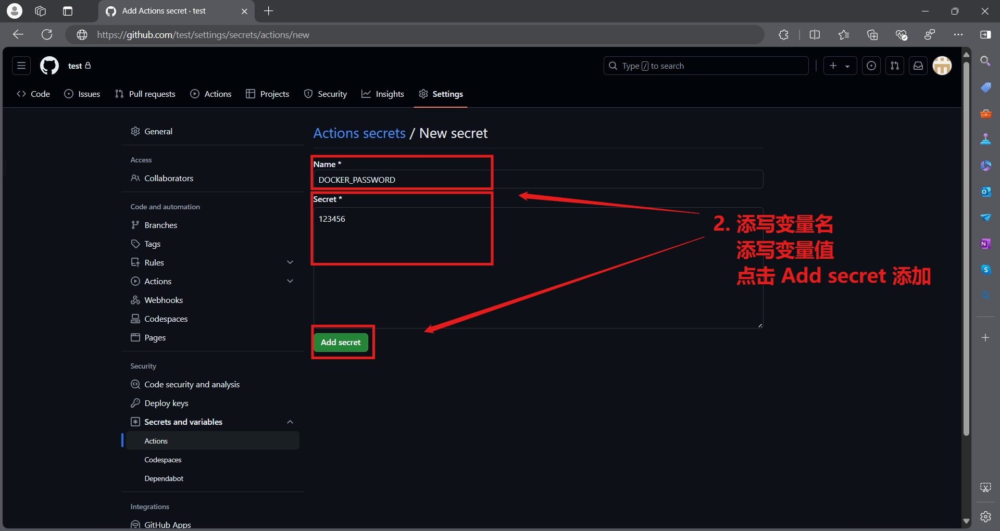
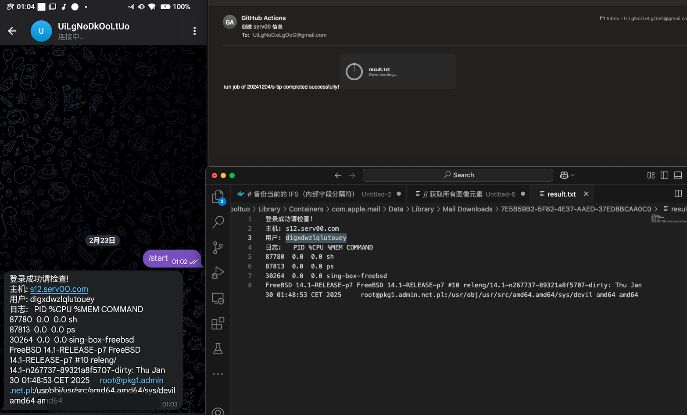

# s-tip
actions workflow 远程 ssh 连接 serv00 并获取一些信息，希望以此维持 serv00 保留 tip 

[](https://github.com/20241204/s-tip/actions/workflows/serv00-tip.yml)    
<a href="https://star-history.com/#20241204/s-tip&Date">
  <picture>
    <source media="(prefers-color-scheme: dark)" srcset="https://api.star-history.com/svg?repos=20241204/s-tip&type=Date&theme=dark" />
    <source media="(prefers-color-scheme: light)" srcset="https://api.star-history.com/svg?repos=20241204/s-tip&type=Date" />
    
  </picture>
</a>

## 描述
1. 这个项目主要是为了临时能够远程连接 serv00 并执行自定义的命令，在 `.github/workflows/serv00-tip.yml` 可以调试
2. 为了实现 actions workflow 自动化运行，需要添加 `GITHUB_TOKEN` 环境变量，这个是访问 GitHub API 的令牌，可以在 GitHub 主页，点击个人头像，Settings -> Developer settings -> Personal access tokens -> Tokens (classic) -> Generate new token -> Generate new token (classic) ，设置名字为 GITHUB_TOKEN 接着要配置 环境变量有效时间，勾选环境变量作用域 repo write:packages workflow 和 admin:repo_hook 即可，最后点击Generate token，如图所示




3. 赋予 actions[bot] 读/写仓库权限，在仓库中点击 Settings -> Actions -> General -> Workflow Permissions -> Read and write permissions -> save，如图所示
 
4. 添加 serv00 服务器域名、用户名和密码并加工为json格式的 `HOSTS_JSON` 变量在 GitHub 仓库页 -> Settings -> Secrets -> actions -> New repository secret 中添加   
> HOSTS_JSON 变量的配置单/多条serv00格式示例
```json
{
  "info": [
    {
      "host": "s0.serv00.com",
      "username": "username0",
      "port": 22,
      "password": "password0"
    },
    {
      "host": "s1.serv00.com",
      "username": "username1",
      "port": 22,
      "password": "password1"
    }
  ]
}
```
5. 添加 tg机器人的token `TELEGRAM_TOKEN` 变量在 GitHub 仓库页 -> Settings -> Secrets -> actions -> New repository secret  
6. 添加 tg机器人的userid `TELEGRAM_USERID` 变量在 GitHub 仓库页 -> Settings -> Secrets -> actions -> New repository secret   
7. 添加 email smtp 服务器域名 `MAILADDR` 变量在 GitHub 仓库页 -> Settings -> Secrets -> actions -> New repository secret    
8. 添加 email smtp 服务器端口 `MAILPORT` 变量在 GitHub 仓库页 -> Settings -> Secrets -> actions -> New repository secret    
9. 添加 email smtp 服务器登录账号 `MAILUSERNAME` 变量在 GitHub 仓库页 -> Settings -> Secrets -> actions -> New repository secret  
10. 添加 email smtp 服务器第三方登陆授权码 `MAILPASSWORD` 变量在 GitHub 仓库页 -> Settings -> Secrets -> actions -> New repository secret  
11. 添加  email smtp 服务器应该发送邮件位置 `MAILSENDTO` 变量在 GitHub 仓库页 -> Settings -> Secrets -> actions -> New repository secret
12. 以上 4~11 步流程类似如图所示



13. 转到 Actions

        -> 批量保活进程 启动 workflow，实现自动化远程连接 serv00 并执行自定义的命令会发送到tg机器人或者邮件  

14. 新目录结构  

        .
        ├── .github                                     # github actions workflow 配置目录  
        │   └── workflows                               # github actions workflow 配置文件目录  
        │       └── serv00-tip.yml                      # github actions workflow 执行配置
        ├── assets                                      # 描述文件图片资源
        └── README.md                                   # 这个是说明文件   

14. 脚本会生成信息发送到 tg机器人 或者发送 result.txt 文件到邮箱，如下图

        1. result.txt
            a. 包含 serv00 信息


# 声明
本项目仅作学习交流使用，不做任何违法行为。所有资源均来自互联网，仅供大家交流学习使用，出现违法问题概不负责。  

# 注意
多人 fork 本项目且一起运行 actions 时，可能会导致本人项目被ban掉，所以，你可以创建新项目，把文件复制过去，自己享用

# 感谢&参考  
frankiejun 大佬的 serv00-play: [https://github.com/frankiejun/serv00-play](https://github.com/frankiejun/serv00-play)  
使用 email smtp 发送邮件: [https://blog.csdn.net/liuyuinsdu/article/details/113878840](https://blog.csdn.net/liuyuinsdu/article/details/113878840)  
